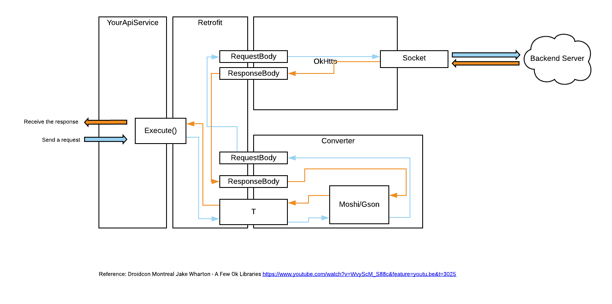

## Goal
Learn how to Retrofit in an Android project

## Background
Retrofit, "a type-safe HTTP client for Android and Java from Square, Inc". It's built on top of a few other Square "ok" libraries.
```
|__ Retrofit
    |__ Moshi (or Gson)
    |__ OkHttp
        |__ java.io and java.nio
```

The advantages of Retrofit is from Okio's implementation. Okio complements `java.io` and `java.nio` to "make it easier to access, store and process the data". In short, Okio is built on `ByteString` and `Buffer`. They do clever things to save CPU and memory.

When building an API service on Android, we'll use Retrofit to define endpoints, setup request header, parse the response and etc. And the request flow can be shown in the below.

 

## Howto
### Dependencies and permission
In `build.gradle` (app), 
```
// Retrofit
implementation "com.squareup.retrofit2:converter-gson:$retrofit_version"
implementation "com.squareup.okhttp3:okhttp:$okhttp_version"
implementation "com.squareup.retrofit2:retrofit:$retrofit_version"
``` 
In `AndroidManifest.xml`,
```
<uses-permission android:name="android.permission.INTERNET"/>
```
### Structure
#### Define API service interface
We can use Retrofit's annotations to define the endpoints. For instance,
```
interface ApiService {
  @GET("/search/{category}")
  suspend fun search(
    @Path("category") category: String,
    @Query("q") query: String,
    @Query("sort") order: SortOrder
  ): Response<List<Product>>;

  @POST("/upload/image")
  @Headers("SomeHeader: SomeValue")
  suspend fun uploadImage(@Body image: Image): Response ;
}
```

#### Create Retrofit service instance
Then we need to create a retrofit client instance with a http client and a converter. For instance,
```

val client = OkHttpClient()
val gson = GsonBuilder().create()

val retrofit = Retrofit.Builder()
        .baseUrl(YOUR_BASE_URL)
        .addConverterFactory(GsonConverterFactory.create(gson))
        .client(client)
        .build()

val retrofitClient = retrofit.create(ApiService::class.java)
```
#### Create the repository to execute the call
`Repository` is a layer in MVVM to handle data operations. It provides a clean API the rest of the app could use to retrieve the data. We can regard it as a mediator between different data sources, such as Room DAO, web services, and caches.

In our case here, we will create a `ProductRepository` to use `ApiService.search`.
```
class ProductRepository(private val apiService: ApiService): List<Product> {
    suspend fun getProductsByCategory(category: String, query: String, order: SortOrder) {
        val response = apiService.search(category, query, order)
        return response.body()!!
    }
}

``` 


#### Call the endpoint within a coroutineScope

```
// other logic ...

val _products = MutableLiveData<List<Product>>()
viewModelScope.launch {
    val products = productRepository.search(category="food", query="us", order="Des")
    _products.value = repo
}

// other logic ...
```
 
